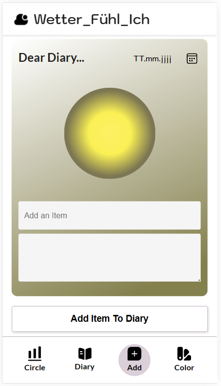
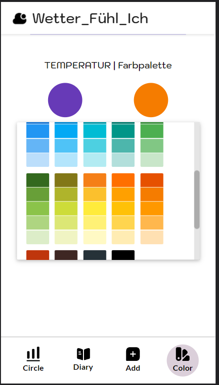
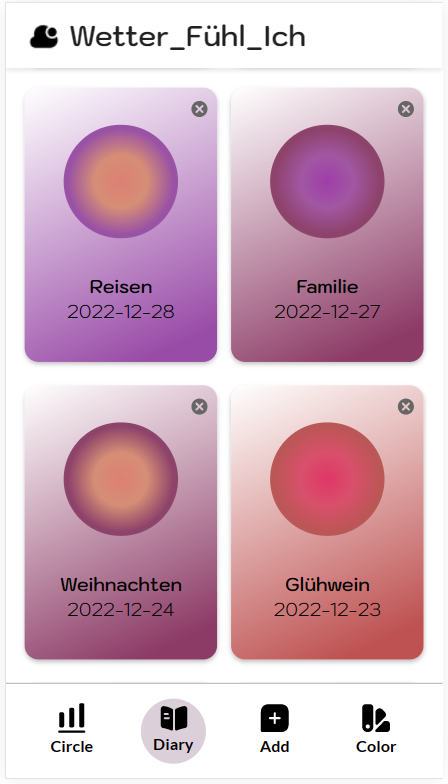

# WetterFühlIch
## Eine Wetter-Tagebuch-App 
von Mihye und Clara

## Beschreibung
Unsere Wetter-Tagebuch App “WetterFühlIch” ist eine Achtsamkeits-App. Mit ihr kann man seine Stimmungen und Wettereindrücke visuell mit Hilfe von individuell einstellbaren Farben lesen, ausdrücken und verstehen. Durch eine Dekonstruktion von standardisierten Farb- und Wetterwahrnehmungen soll ein neuer Blickwinkel endstehen. Mit Hilfe von Tagebucheinträgen kann der/die Nutzer*in reflektieren und sich sensibilisieren. Die Mobile Webanwendung ist besonders an Gestalter*innen und Kreative gerichtet. Ziel ist eine ganzheitliche Reflektion und im besten Fall ein Umschreiben der eigenen, auch kulturell geprägten, Stereotype in der Wetter- und Farbwarnehmung.

  

## Implementierung
Das Projekt WetterFühlIch wurde mit React,Redux und der Programmiersprache JavaScript realisiert. Mit Hilfe von Node.JS kann unsere App geöffnet werden.
Laden Sie sich dafür Node.Js herunter und öffnen sie  den Ordner in ihrer Shell indem sich die Dateien für die App befinden.
Geben Sie nun folgende Befehle ein:

1 - in der Datei weatherApi ein token zum Apifetching hinzufügen (siehe ./components/services/weatherApi.js)

2 - run "npm install"

3 - run "npm start"

Als Entwicklerplattform haben wir Visual Studio Code verwendet.

## Tech Stack

- React
- Bootstrap
- React Color Picker
- Redux

### Autor

Clara Osterburg Correa (Logik/Persistenz, Design/Styling, Konzept)

Mihye (Umsetzung CSS/Styling, Film)

